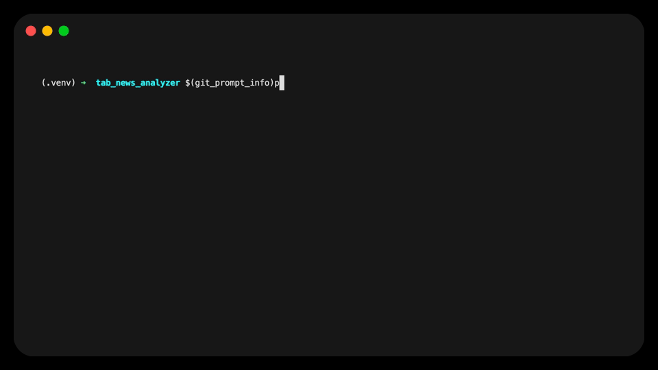

# TAgent: Build Powerful AI Agents, Not Boilerplate

[](https://www.python.org/downloads/)
[](https://opensource.org/licenses/MIT)
[](https://github.com/yourusername/tagent2)

**A developer-first framework for crafting everything from simple AI assistants to complex, multi-agent workflows with elegance and ease.**



---

## Why TAgent?

-   **Focus on Your Logic**: Stop wrestling with complex frameworks. Write standard Python functions, and TAgent's `ToolExecutor` intelligently adapts to them.
-   **Build, Don't Just Prompt**: Move beyond simple prompting. Create robust, stateful agents that can plan, execute, and learn from their actions.
-   **Scale with Confidence**: Start with a single agent for a simple task. As your needs grow, scale up to a multi-step, parallelized workflow with the powerful **Pipelines** engine.
-   **Universal Compatibility**: TAgent is model-agnostic. By using structured JSON outputs instead of proprietary function-calling, it works with hundreds of LLMs out-of-the-box.

## Features at a Glance

-   **🧠 Task-Based Agents**: Predictable, state-driven agents that plan and execute to achieve goals.
-   **🛠️ Developer-First Tools**: Your Python functions are first-class citizens. No boilerplate required.
-   **🚀 Powerful Pipeline Engine**: Orchestrate complex, multi-step workflows with dependencies, parallelism, and advanced data flow control.
-   **🔗 Smart Data Injection**: Use `read_data` to automatically inject outputs from previous steps as tool parameters, enabling sophisticated prompt enhancement.
-   **🌐 Model Agnostic**: Compatible with any LLM provider, including OpenAI, Google, Anthropic, and more via LiteLLM.
-   **🔒 Structured & Reliable**: Enforces structured outputs for predictable, type-safe results using Pydantic.
-   **🤖 Simple & Scalable**: Start with a few lines of code and grow to production-grade automations.

---

## Quick Look

See how easy it is to give an agent a custom tool.

```python
from tagent import run_agent

# 1. Give your agent a goal
goal = "What is the current stock price for NVDA and should I buy it?"

# 2. Give it a tool (a simple Python function)
def get_stock_price(symbol: str):
    """A tool to get the latest stock price for a stock symbol."""
    print(f"--- Getting price for {symbol} ---")
    # (Your logic to call a real stock API would go here)
    if symbol == "NVDA":
        return "stock_price", {"symbol": "NVDA", "price": 950.00}
    return "stock_price", {"symbol": symbol, "price": "unknown"}

# 3. Run the agent
result = await run_agent(
    goal=goal,
    tools=[get_stock_price],
    model="gpt-4o-mini"
)

print(result.output.result)
```

---

## Installation

Get started in seconds. Install the core agent, or include optional extras like the Pipeline engine.

```bash
# Install the core agent
pip install tagent

# Install with the Pipeline engine
pip install "tagent[pipeline]"

# Install everything
pip install "tagent[all]"
```

---

## Dive Deeper

This README is just a glimpse of what TAgent can do. For detailed guides, tutorials, and API references, please visit our full documentation.

# ➡️ [Read the Full TAgent Documentation](./documentation/README.md)

Our documentation covers:
-   **Core Agent**: Getting started, creating tools, and configuration.
-   **Pipelines**: Building complex, multi-step workflows with dependencies, parallel execution, and advanced data flow features like `read_data`.
-   **API References** and more.

---

## Contributing

We welcome contributions! Please see our [contributing guide](CONTRIBUTING.md) for details on how to get started.

## License

This project is licensed under the MIT License. See the [LICENSE](LICENSE) file for details.